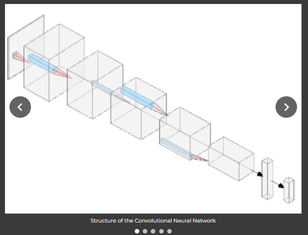

# Custom Bootstrap 4  + CSS + JavaScript gallery carousel for art portfolio website
 
*The name "carousel" refers to an old type of mechanical slide projector. Its graphical counterpart represents a web gallery, auto-rotating slides, to show images in a webpage.*

This carousel was created as a personal project (for my father's [portfolio website](antoniomusumeci.com)) and also on [my personal website](https://sites.google.com/view/emanuelemusumeci/blog/custom-bootstrap-carousel)). The idea was to use the carousel of a well-supported HTML framework ([Bootstrap 4](https://getbootstrap.com/docs/4.0/components/carousel/)) and enrich it with additional functionalities.

    
    <em>Standard bootstrap carousel with captions, slide indicators (horizontal lines on the bottom) and previous/next arrows</em>

In its "native" form, the Bootstrap carousel, offers basic functionalities, such as: automatically rotating slides, a series of indicators at the bottom styled as dots and previous/next arrows.

Google sites offers a very bare gallery carousel, without the possibility of showing previews., while I wanted to give a more "stylish" and "professional look to the gallery. 

    
    <em>Carousel embeddable in the Google Sites interface</em>

I had to find a way to show pictures in a carousel without paying for a hosting service (we wanted to keep the project low-budget). So I opted to show images shared from a Google Drive folder and I wrote a script to generate HTML code automatically given a list of image links, to embed the images in the carousel.

    
    <em>The custom carousel in this repository</em>

Then I added several functionalities to improve the graphical appearance:
* the default dot indicators are replaced with thumbnail previews, with a script to automatically center the thumbnail linked to the currently active slide and a script to change slide if a preview thumbnail is clicked
* the previous next arrows shadowing effect is obtained simply using CSS effects and animations
* the carousel is shaped as to fit in portrait mobile mode: this was very tricky as Google Sites doesn't isolate its CSS from the one in the embedded code, so it was more a trial-and-error process
* whenever a slide is clicked, the image is opened in full scale in a new tab.